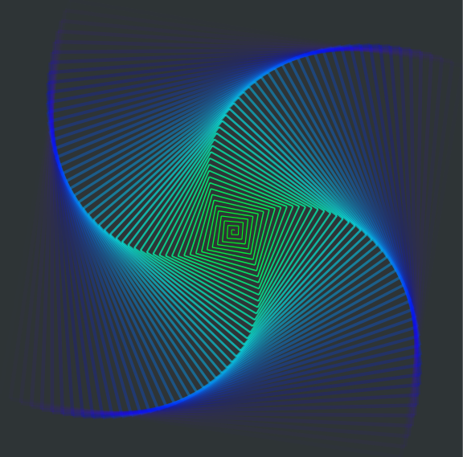
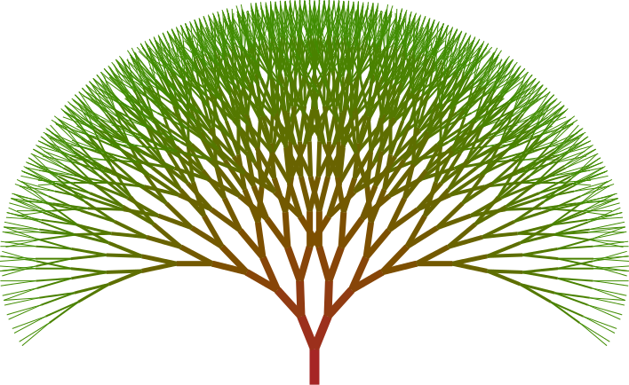

# turtle-graphics

https://package.elm-lang.org/packages/mrdimosthenis/turtle-graphics/latest/

This is an Elm library that enables us to command a relative cursor *(turtle)* to draw vector graphics!

1. **Install** by running `elm install mrdimosthenis/turtle-graphics` in your project's root directory
2. **Import** by typing `import TurtleGraphics` at the top of your module
3. **Create** amazing graphics

The source code that generates these images can be found in *examples*

